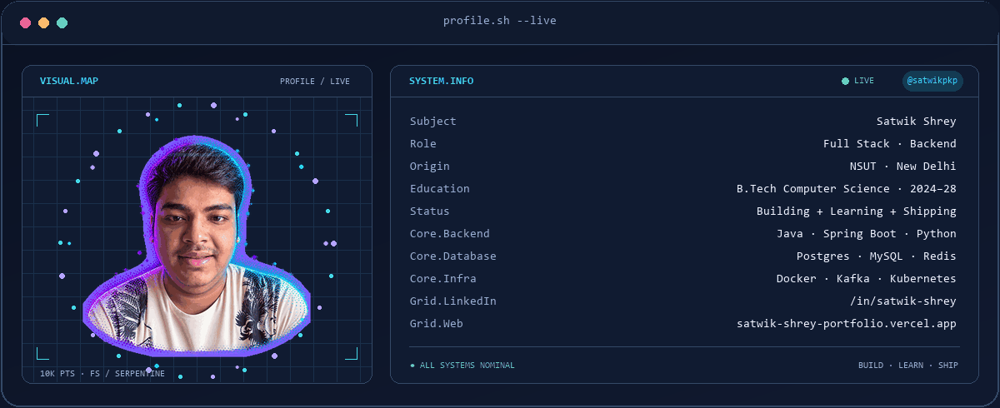
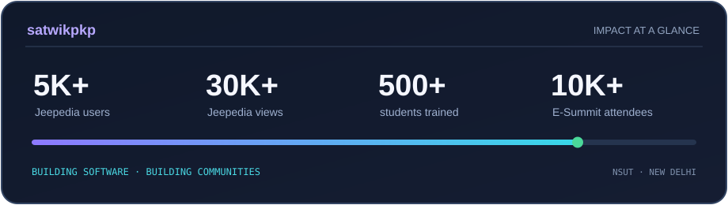

<picture>
  <source media="(prefers-color-scheme: dark)" srcset="assets/banner-dark.gif">
  <source media="(prefers-color-scheme: light)" srcset="assets/banner-light.gif">
  
</picture>

 

&nbsp;&nbsp;
&nbsp;&nbsp;

---

## `whoami` — Satwik Shrey

Computer Science student at **Netaji Subhas University of Technology (NSUT)** and full stack developer focused on backend systems, maintainable services, and thoughtful product details.

- 🎓 B.Tech in Computer Science and Engineering, NSUT · 2024–2028
- ⚙️ Java, Spring Boot, PostgreSQL, and microservices
- 🌐 React, Next.js, Node.js, and Python
- 🤖 Exploring practical AI and machine learning applications
- 🧭 Operations and community leadership with GDG NSUT and eCell NSUT

## `selected.projects`

<table>
<tr>
<td width="50%" valign="top">

### Jeepedia
**Admissions data, made explorable.**

Python data pipeline and Next.js dashboard for multi-year JoSAA/JAC admissions data, backed by optimized PostgreSQL queries. Reached **5K+ unique users** and **30K+ views** in its first month; selected for GSSoC.

`Next.js` `Node.js` `PostgreSQL` `Python`

[Frontend](https://github.com/satwikpkp/frontend) · [Backend](https://github.com/satwikpkp/backend) · [Portfolio](https://satwik-shrey-portfolio.vercel.app/#projects)

</td>
<td width="50%" valign="top">

### Aasra
**An AI care platform for families.**

Turns voice notes, OCR, and records into a semantic memory graph. Includes grounded Q&A, FastAPI services, Firebase authentication, tenant isolation, and real-time Firestore sync.

`React Native` `Expo` `FastAPI` `Mem0` `Firebase`

[Repository](https://github.com/satwikpkp/Aasra) · [Live demo](https://aasra-web.vercel.app/) · [Video](https://youtu.be/ZVHivseSlrQ)

</td>
</tr>
</table>

## `toolchain`

**Backend:** Java · Spring Boot · Spring MVC · Spring Batch · Spring Security · Spring Cloud · Hibernate/JPA · REST APIs  
**Data & systems:** PostgreSQL · MySQL · MongoDB · Redis · Linux  
**Tools:** Git · Docker · Kubernetes · Kafka · Maven · Postman

## `signals`

<table>
<tr>
<td width="50%" align="center" valign="middle">
<strong>Engineering & community</strong>  
Backend systems · Product engineering · Full stack development · Open source · Student communities
</td>
<td width="50%" align="center" valign="middle">
<strong>Leadership & impact</strong>  
SHUNYA AI/ML hackathon · 5,000+ student developers 
Machine-learning training · 500+ freshmen 
E-Summit 2025 · 10,000+ attendees
</td>
</tr>
</table>

## `milestones`

<table>
<tr><td>🏆</td><td><strong>7th of 900+ teams</strong></td><td>National Entrepreneurship Challenge · IIT Bombay</td></tr>
<tr><td>🥉</td><td><strong>Third place</strong></td><td>Deciphering the Labyrinth · IIT Bombay E-Summit 2025</td></tr>
<tr><td>📚</td><td><strong>99.2 percentile</strong></td><td>JEE Main · 1.5M+ candidates</td></tr>
</table>

## `numbers.matter`

<picture>
  <source media="(prefers-color-scheme: dark)" srcset="assets/card-stats-dark.svg">
  <source media="(prefers-color-scheme: light)" srcset="assets/card-stats-light.svg">
  
</picture>

---

Built with curiosity · <a href="https://satwik-shrey-portfolio.vercel.app/">satwik-shrey-portfolio.vercel.app</a>

