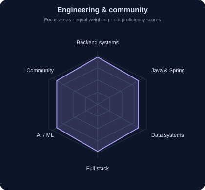
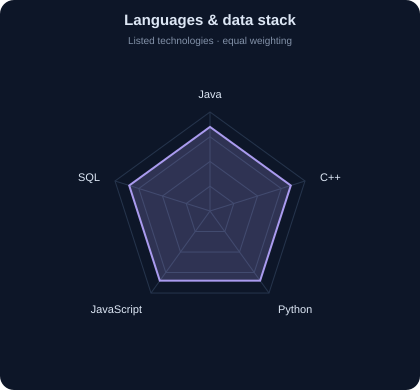
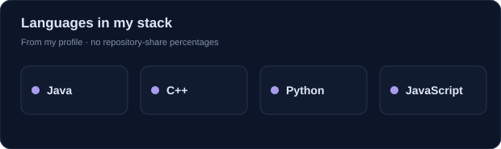

<!-- BANNER - terminal profile.sh --live (additive). Generated by scripts/banner/generate.py.
     ~0.7–0.8 MB each. Cache-bust with ?v=N after regenerating. -->
<picture>
  <source media="(prefers-color-scheme: dark)"  srcset="assets/banner-dark.v9.svg">
  <source media="(prefers-color-scheme: light)" srcset="assets/banner-light.v9.svg">
  
</picture>

 

<!-- NAME / TAGLINE - animated typing -->

 

<!-- SOCIALS — LinkedIn stays brand blue (glyph vanishes on custom fills). Others themed. -->
&nbsp;&nbsp;;
&nbsp;&nbsp;;

 

---

## This is me :)

Hey, I'm **Satwik**, a full stack developer who loves building clean, modern websites and apps where design, functionality, and even the smallest details matter, with a focus on making products that are both practical and visually satisfying

- 🎓 Pursuing a **B.Tech in Computer Science and Engineering at NSUT DELHI**
- 🧭 Leading operations and community initiatives with **GDG NSUT and eCell NSUT**
- 🤖 I spend most of my time in the **terminal**,**browser** or **scribbling on a whiteboard.**
- 🌐 I lean **backend**, not because I don't like **frontend**, but because I enjoy making **polished things actually hold up.**
- 💬 I don't ship **junk** , **Maintainability isn't optional** **And I build best when I'm curious**.
- ⚙️ Working with **Java, Spring Boot, PostgreSQL, and microservices** & Building across the stack with **React, Next.js, Node.js, and Python**
 

## my perfect stack`

---

## signals 

<table>
<tr>
<td width="50%" align="center" valign="middle">

<!-- Self-rated radar - edit assets/skills.json, the workflow redraws it -->
<picture>
  <source media="(prefers-color-scheme: dark)"  srcset="assets/radar-dark.svg">
  <source media="(prefers-color-scheme: light)" srcset="assets/radar-light.svg">
  
</picture>

</td>
<td width="50%" align="center" valign="middle">

<!-- Hand-authored contract & language stack radar - edit assets/langmix.json -->
<picture>
  <source media="(prefers-color-scheme: dark)"  srcset="assets/radar-langs-dark.svg">
  <source media="(prefers-color-scheme: light)" srcset="assets/radar-langs-light.svg">
  
</picture>

</td>
</tr>
</table>

---

## Numbers matter? ohhh yes. 

<!-- Generated by scripts/cards.py into this repo. Deliberately NOT
     github-readme-stats / streak-stats / github-profile-trophy: those are
     shared public instances that go down and take the whole section with them. -->
<picture>
  <source media="(prefers-color-scheme: dark)"  srcset="assets/card-stats-dark.svg">
  <source media="(prefers-color-scheme: light)" srcset="assets/card-stats-light.svg">
  
</picture>

 

---

` Build with love· @satwikpkp `

